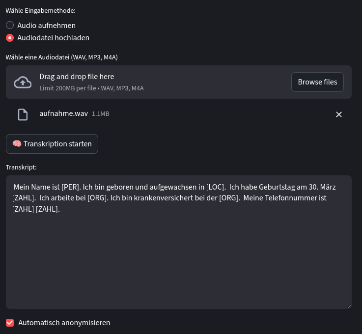

# 🤖 Transkript Automatisierung

Die **Transkript Automatisierung** ist eine datenschutzfreundliche, modulare Streamlit-Anwendung zur
automatischen **Transkription** und **Anonymisierung des Inhalts**.  
Die Anwendung nutzt **Whisper (faster-whisper)** zur Spracherkennung und **spaCy** zur Textanonymisierung.



---

## 🚀 Funktionen

- 🎙️ **Audioaufnahme über Mikrofon**
  - Auswahl des Eingabegeräts (z. B. bestimmtes Mikrofon)
  - Live-Indikator, ob das Mikrofon aufnimmt
- 📝 **Automatische Transkription**
  - Unterstützt mehrere Sprachen (z. B. Deutsch, Englisch)
  - Optimiert für Genauigkeit und Geschwindigkeit mit `faster-whisper`
- 🔒 **Anonymisierung**
  - Entfernt automatisch Namen, Orte, Organisationen usw.
  - Datenschutzkonform durch lokale Verarbeitung

---

## 💡 **Erweiterungen (in Planung)**

- 🔴 **Live-Transkription (Speech-to-Text in Echtzeit)**
  -  Intuitive User Experience

- 🧍🧍‍♀️ **Sprechererkennung (Speaker Diarization)**
  - Ordnet Textabschnitte verschiedenen Personen zu (z. B. „Person 1:“ / „Person 2:“)

- 🌐 **Webhosting mit externer GPU-Anbindung**
  - Ressourcenschonend und schneller!

- 📜 **Export in Formate wie .txt, .csv oder .json**
  - Flexibele weiterverarbeitungs möglichkeiten

- 🔍 **Inhaltzusammenfassung auf Anonymisierter Grundlage**
  - Die wichtigsten Punkte werden Zusammengefasst und bei bedarf im Konjunktiv umschrieben.

## 🧰 Projektstruktur

```plaintext
Transkriptor/
│
├── transcriptor/
│   ├── app.py                     # Haupt-Streamlit-App
│   └── modules/
│       ├── recorder.py            # Audioaufnahme
│       ├── transcribe.py          # Whisper-Transkription
│       └── anonymize.py           # Anonymisierung mit spaCy
│
├── requirements.txt
└── README.md
```

## 📦 Requirements
| Paket              | Zweck              |
| ------------------ | ------------------ |
| `streamlit`        | Weboberfläche      |
| `faster-whisper`   | Transkription      |
| `sounddevice`      | Audioaufnahme      |
| `spacy`            | Anonymisierung     |
| `numpy` / `scipy`  | Audiobearbeitung   |
| `torch` (optional) | GPU-Beschleunigung |
